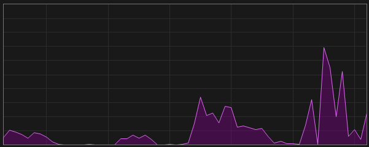

# Take-Home Interview Task

## Objective
As part of our interview process, we would like you to extend an existing whole slide image (WSI) viewer to visualize segmentation results. This task is designed to assess your ability to work with image data, design frontend–backend interactions, and deliver a functional solution with clean, maintainable code. Given that our lab is building a cutting-edge medical AI platform, this assignment aligns closely with the type of work you would be involved in. You are welcome to use any AI tools to assist you during this coding challenge.

We understand that this is a complex task with multiple components.
Even if you don't complete every feature, feel free to share your ideas on how you would approach the solution.
We're excited to see what you come up with.
Happy coding, and good luck! 🚀


## Provided Materials
- **Sample whole slide image**: `CMU-1.svs`  
  Can be downloaded via `wget`:
  ```bash
  wget https://openslide.cs.cmu.edu/download/openslide-testdata/Aperio/CMU-1.svs
  ```
- **Segmentation results**: HDF5 format (`.h5`) file(s), to be provided  
- **Prebuilt WSI viewer sample code using Vite.js + React + Flask**

## Task Requirements
1. Using the provided basic sample code, develop a **new** WSI image viewer with **Electron**, **Next.js**, **Typescript**, and **FastAPI**. Users can upload a WSI file and view it.
2. Overlay the segmentation results on the WSI. It's not necessary to show every detail at once. Here's a simple strategy:  
   - Create a canvas overlay and refresh it whenever the viewport changes (you can use polling HTTP requests or WebSocket for real-time updates).  
   - Display segmentation centroids by simple dots at low zoom levels.  
   - Switch to detailed contour overlays once the viewer is zoomed in past a certain threshold.
   - To better explain the strategy, please see the video ./assets/q2.mp4. And if you have any other ideas, we'd love to hear them! Looking forward to see your solution beat our reference implementation.
3. Implement a sidebar **"Management"** page where users can review **all** segmentation results. Hint: you can do pagination.  
4. Add user-annotation functionality:  
   - Users can crop a region and change the color of annotations within the cropped region. 
5. Use **Tailwind CSS** and any React UI component libraries to build the front-end UI, and integrate API documentation into the backend (e.g., via Swagger/OpenAPI).
6. Please feel free to design the UI as you see fit and add any features you think are important to the user experience. You can use any AI tools to assist development.


> **Important Note**  
> The sample code applies a 16× magnification factor.  
> - When converting raw centroid or contour coordinates to viewer space, multiply them by 16.  
> - When initializing OpenSeadragon ImageViewer, multiply tile or region dimensions by 16 (already done in the sample code).

## General Expectations
- Write clean, maintainable, and well-documented code.  
- Include a README with setup instructions (e.g., how to run locally).  
- Implement reasonable error handling (e.g., file loading failures, invalid input, 404 pages, etc.).

## Optional Bonus Tasks (choose one)
- User Behavior Chart: Integrate a small line chart to track user interactions. When the user pans or zooms, the backend should compute the number of segmentation centroids currently in view and update the chart in real time.

  Example of expected chart visualization:
  

- On-Demand Segmentation: Implement a Start Segmentation button that initiates an asynchronous backend job. Use a SAM model to perform segmentation on the current viewport region, and update a progress bar via Server-Sent Events (SSE).

## Submission Guidelines
- Complete the task within 24 hours after receiving the materials.
- Please record a video to illustrate your implementation.
- Submit your **code** and **recording** via a GitHub link. If the recording is too large, you can upload it to Google Drive or a similar platform and share the link.
- Include a README explaining how to run your project locally.  
- The purpose of designing multiple diverse questions is to more effectively distinguish among candidates. So it's ok if you don't complete all of the task since there are too many features to implement. You can still upload what you have done. This take-home interview is to see your coding skills, coding style, and how you approach a problem. So, if time constraints prevent full implementation, please describe your design ideas and intended approach in the README or a separate document.

## Useful References
- OpenSeadragon API documentation: https://openseadragon.github.io/docs/  
- OpenSeadragon plugins overview: https://openseadragon.github.io/  
- Coordinate conversion guide: https://openseadragon.github.io/docs/OpenSeadragon.Viewport.html  
